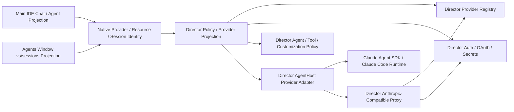

# 120 Agents Window + Wave 3 Reviewed Execution Plan

Date: 2026-05-20

Status: reviewed execution plan. This is a plan-only document. No runtime or replay patch implementation is included here.

## Purpose

This document turns the Agents Window and Wave 3 Claude AgentHost research into an implementation plan that can be executed in slices.

Product decision:

- Keep the 120 Agents Window.
- Make it consistent with the main Director IDE chat/agent surface.
- Reuse VS Code 120 AgentHost, Agent Sessions, Claude session UI, permission UI, event rendering, and SDK execution model.
- Replace upstream Copilot/CAPI provider, auth, proxy, model, account, and entitlement assumptions with Director-owned policy.

## Review Corrections

The first execution draft had the right direction but missed several hard gates.

Changes made after multi-angle review:

- Segment 0 is now a blocking replay-control gate, not just discovery.
- Segment 1 now requires an explicit `IDirectorSessionsPolicyService` and named choke points.
- Segment 1 must not hide or degrade customization. Customization must remain visible and be aligned with the main IDE / VS Code behavior.
- Segment 2 shared Director session index direction is superseded. VS Code 120 does not make IDE Chat history and Agents Window agree through a bidirectional shared index; Segment 2.1 keeps only native local-session repair, and Segment 3 owns the real shared backend direction.
- Segment 2.1 is now narrowed to native local-session repair only: New Chat pending lifecycle, first-send materialization, workingDirectory metadata, and `UNKNOWN` / `unknown:///` cleanup. It must not claim IDE / Agents Window cross-window synchronization.
- Runtime validation of commit `96130410c96ad91078ab5473e0ec8aa077ebb375` showed that IDE and Agents Window sessions do not synchronize at all through the native local bridge.
- Segment 3 is now the first segment allowed to claim true IDE / Agents Window session consistency. It requires an AgentHost-style shared backend / Director AgentHost provider bridge, not more local chat provider patching.
- Segment 3 now separates SDK-visible model ids from Director routing ids, defines the shared backend session catalog boundary, and keeps a concrete auth/proxy boundary with a strict SecretMaterial invariant.
- Segment 4 now treats Claude production provider registration as missing work, not as already wired.
- Segment 4 now explicitly replaces GitHub/Copilot protected resources, `ICopilotApiService`, and the process-global `ClaudeProxyService.start(githubToken)` token slot.
- The validation ladder now includes replay patch generation, series hash refresh, clean materialization, canonical manifest refresh, and final `validate-all`.

Current recovery state:

- HEAD `e327731d` already contains the wrong-direction Segment 2 shared-index implementation.
- The current working tree also has uncommitted shared-index extension changes in replay patch/report files. Keep the plan document, but the shared-index extension dirty work must be recovered or discarded by a later implementation worker.
- This plan update is documentation-only. It does not approve or complete the existing shared-index implementation.

## Non-Goals For Wave 3 V1

- No parallel Director-only replacement for `vs/sessions`.
- No parallel Director-only AgentHost implementation.
- No CodePilot-style runtime re-resolution where one existing session silently changes agent kind.
- No OpenAI/Gemini/Codex-to-Anthropic protocol translator in the first Claude registration.
- No attempt to make Claude SDK tools identical to Director Ask/Edit/Agent tool calls in v1.
- No generated-tree-only fix accepted as complete.
- No direct import of workbench-owned Director provider/auth services from `vs/platform/agentHost/**`.

## Execution Principles

- Agent kind is fixed at session creation time.
- Director Provider Registry is the canonical provider/model source.
- Do not create a second Provider Registry for Agents Window or AgentHost. Agents Window setup/status and provider choices must read the same Director Provider Registry state used by the main IDE.
- The AgentHost provider/model bridge is a projection and safety boundary, not a new provider system. It turns Director Registry state into serializable session/model descriptors and proxy routing handles that `vs/sessions` and AgentHost can consume.
- `anthropic-messages` is the v1 API-family gate for Claude-compatible providers.
- `vs/sessions` remains mostly a UI and provider-consumer surface.
- Director-owned logic should live in Director-owned modules or a bounded AgentHost adapter island.
- Upstream provider/session IDs should be wrapped or filtered before being renamed.
- Segment 1 is a safety facade only. It may filter, hide, or redirect broken provider/account surfaces, but it must preserve customization visibility and must not introduce the shared cross-window index.
- Segment 2.1 must not add or expand a Director shared session index. It owns only native local-session repair inside one window: provider/resource/session identity hygiene, workspace metadata, and New Chat pending lifecycle.
- Segment 2.1 consistency is window-local native correctness. It does not mean IDE Chat / Agents Window synchronization, because `IChatSessionsService` and `LocalAgentsSessionsController` are window-local.
- AgentHost-style shared backend sessions are the source of truth for real IDE / Agents Window consistency. Segment 3 must make both surfaces project the same backend session catalog rather than trying to sync two local chat stores.
- Director Claude must not publish or trigger GitHub/Copilot protected resources.
- Auth bridge default is a short-lived proxy handle. Scoped resolved auth config is out of v1 unless a separate security review explicitly accepts it.
- Auth boundary invariant: API keys, OAuth access/refresh tokens, env-var credential values, sensitive custom auth headers, proxy nonces, and SDK bearer tokens are SecretMaterial. Wave 3 must not introduce any new copy of SecretMaterial into AgentHost root state, `AgentInfo.models._meta`, `IAgentCreateSessionConfig.config`, `SessionConfigChanged`, native session/catalog persistence, session `configValues`, output channels, JSONL logs, or reports. Existing Provider Registry custom-header storage is a separate hardening item; Claude bridge v1 must keep those values inside the Director proxy boundary rather than expanding their exposure.

## Architecture Target



## Segment 0: Blocking Baseline And Ownership Gate

Goal: establish a clean replay-backed baseline and path ownership before runtime edits.

Inputs:

- `docs/upgrade/profiles/index.json`
- `docs/upgrade/profiles/120-insider-win32-x64-client.json`
- `patches/series.120-insider.json`
- `scripts/upgrade/generate-director-patches.mjs`
- `docs/upgrade/reports/120-insider-win32-x64-client/agents-window-investigation.md`
- `docs/upgrade/reports/120-insider-win32-x64-client/agents-window-wave3-claude-bridge-plan.md`
- `docs/upgrade/120-insider-upgrade-plan.md`
- `docs/upgrade/116-phase2-waves-plan.md`

Tasks:

1. Confirm active profile is `120-insider-win32-x64-client`.
2. Run `validate-all` before Segment 1 edits.
3. If validation fails, either clean-materialize from replay or convert the current generated-tree drift into replay-backed changes before implementation starts.
4. Inventory all visible Agents Window provider/session type registrations.
5. Inventory AgentHost production startup and provider registration points.
6. Inventory account/status/sign-in actions in `vs/sessions`.
7. Inventory customization/skills roots in the sessions window.
8. Map every candidate implementation path to a replay stage.
9. Update `scripts/upgrade/generate-director-patches.mjs` before touching any path that is not already classified.

Known path-classification decisions:

- Do not broad-own `src/vs/sessions/**`.
- Do not broad-own `src/vs/platform/agentHost/**`.
- Use exact allowlist for most existing upstream files.
- Use a narrow `004` prefix for the Claude adapter island: `src/vs/platform/agentHost/node/claude/**`.
- If a new Director AgentHost bridge island is added, use a narrow `004` prefix such as `src/vs/platform/agentHost/node/director/**`.
- Do not add a Director Sessions provider/facade island for Segment 2.1. The earlier `src/vs/sessions/contrib/directorSessions/**` allowlist belongs to the superseded shared-index direction and should be removed during implementation cleanup.

Path ownership size estimate:

- Broad `src/vs/sessions/**` would cover 375 files.
- Broad `src/vs/platform/agentHost/**` would cover 192 files.
- Broad-owning both would allow 567 upstream files to be captured by Director patches. This is not justified for this wave.
- Segment 0/1 should be a small first slice, expected to touch about 6-8 upstream files.
- The complete minimal Wave 3 path should classify about 26 explicit code files, with optional paths up to about 30 if the session facade needs extra service hooks.
- `src/vs/platform/agentHost/node/claude/**` currently contains 12 TypeScript files and 22 files total. It is the only existing upstream subtree small and cohesive enough to justify a narrow prefix if needed. Actual code edits should still be fewer, mostly around `claudeAgent.ts`, `claudeProxyService.ts`, `claudeProxyAuth.ts`, `claudeModelId.ts`, and transcript restore or mapping helpers.
- Classification coverage does not automatically put untouched files into replay patches; it only prevents unclassified generated-tree diffs. The risk of a broad prefix is future accidental capture across large upstream surfaces, not immediate patch size.

Why these upstream files are covered:

| Area | Expected coverage | Why it is needed |
| --- | --- | --- |
| Agents Window account/setup facade | 2-3 files | Remove or replace dead account/sign-in remnants and ensure setup state reflects Director auth instead of GitHub/Copilot assumptions. |
| Sessions provider exposure | 4-5 files | Make Agents Window list the same Director-visible session/provider set as the IDE surface while preserving VS Code's provider aggregation shape. |
| Native local-session catalog correction | 0-3 files | Keep `CopilotChatSessionsProvider` and `LocalAgentsSessionsController` aligned on provider/resource/session identity without adding a Director shared-index provider island. |
| AgentHost production registration | 5-6 files | Restore/register Claude AgentHost in Director and route it through Director-owned provider/auth/proxy policy. |
| Claude adapter island | 12 TypeScript files classified, fewer actually edited | Keep VS Code's Claude Code behavior while swapping the backend from Copilot/CAPI to Director Provider Registry and implementing history restore. |

Likely exact `005` allowlist:

- `src/vs/sessions/browser/accountTitleBarState.ts` (already classified; may need a small follow-up)
- `src/vs/sessions/contrib/copilotChatSessions/browser/copilotChatSessions.contribution.ts` (already classified; may need a small follow-up)
- `src/vs/sessions/contrib/copilotChatSessions/browser/copilotChatSessionsProvider.ts`
- `src/vs/sessions/contrib/accountMenu/browser/account.contribution.ts`
- `src/vs/sessions/browser/sessionsSetUpService.ts`
- `src/vs/sessions/contrib/agentHost/browser/baseAgentHostSessionsProvider.ts`
- `src/vs/sessions/contrib/agentHost/browser/localAgentHostSessionsProvider.ts`
- `src/vs/sessions/contrib/agentHost/browser/localAgentHost.contribution.ts`
- necessary `src/vs/sessions/services/sessions/**` contract/management files only when Segment 2.1 local repair needs them

Likely exact `004` allowlist:

- `src/vs/platform/agentHost/node/agentHostMain.ts`
- `src/vs/platform/agentHost/node/agentHostServerMain.ts`
- `src/vs/platform/agentHost/node/agentService.ts`
- `src/vs/platform/agentHost/node/agentSideEffects.ts`
- `src/vs/platform/agentHost/common/agentService.ts`
- `src/vs/platform/agentHost/electron-main/electronAgentHostStarter.ts`
- `src/vs/platform/agentHost/node/shared/copilotApiService.ts` only if it is still touched; prefer replacing its usage instead of expanding it

Replay impact:

- Control-plane changes may be required before runtime work.
- Prefer exact allowlists first.
- Narrow prefixes are allowed only for clearly bounded Director-owned adapter islands.
- Broad prefixes over whole upstream surfaces are not justified by the current minimum implementation.

Exit gate:

- `validate-all` is green, or current drift is explicitly accepted and replay-backed.
- A file/path ownership map exists.
- Every touched path is classified into `004`, `005`, `007`, `003`, or an explicit control-plane update.
- No implementation starts with ambiguous stage ownership.

## Segment 1: Safe Agents Window Facade

Goal: keep the Agents Window visible while stopping broken upstream account UI and uncontrolled provider/session exposure, without degrading customization behavior.

This is the first user-visible fix slice.

Tasks:

1. Define a Director-owned `IDirectorSessionsPolicyService`.
2. Split policy consumption into two layers:
   - a workbench/browser-side policy service that can consume Director provider/auth/customization state
   - a serializable AgentHost policy snapshot or descriptor that can cross the AgentHost boundary without importing workbench services
3. The workbench policy service owns account status, setup routing, provider visibility, session type visibility, create-session permission, visible labels/icons, customization alignment, remote-agent visibility, and empty state.
4. Wire policy or policy snapshots into both provider paths:
   - `CopilotChatSessionsProvider.getSessionTypes`
   - `CopilotChatSessionsProvider.createNewSession`
   - `CopilotChatSessionsProvider._refreshSessionCache`
   - `BaseAgentHostSessionsProvider._syncSessionTypesFromRootState`
   - `BaseAgentHostSessionsProvider.createNewSession`
   - `BaseAgentHostSessionsProvider._refreshSessions`
   - `LocalAgentHostSessionsProvider`
   - `AgentHostContribution._handleRootStateChange`
   - AgentHost root-state registration
5. Replace `Account`, `Sign In`, and `Agents is signed out` behavior with Director provider/auth state.
6. Route setup/sign-in actions to Director Provider Settings or Director OAuth/API-key flows.
7. Suppress upstream GitHub/Copilot protected-resource authentication for Director Claude.
8. Before Segment 3, runnable Claude eligibility is conservative false unless an enabled Director `anthropic-messages` provider can be resolved without crossing the AgentHost auth boundary.
9. If VS Code-style Claude Code availability is detected but no eligible Director provider/auth exists yet, expose at most a setup-gated Director Claude affordance that routes to Director Provider Settings. It must not start an AgentHost session.
10. Hide raw Copilot, GitHub entitlement, and unapproved Claude session affordances.
11. Keep upstream provider IDs internally where needed for compatibility, but change visible branding and availability.
12. Hide remote AgentHost providers in Wave 3 v1 unless they are explicitly brought under Director policy.
13. Keep customization entry points visible. Align their source discovery and presentation with the main IDE / VS Code behavior, including internal skills when VS Code exposes them.
14. Add a clear Director setup CTA when no Director-approved sessions or providers exist.

Candidate files:

- `src/vs/sessions/browser/accountTitleBarState.ts`
- `src/vs/sessions/contrib/accountMenu/browser/account.contribution.ts`
- `src/vs/sessions/browser/sessionsSetUpService.ts`
- `src/vs/sessions/services/sessions/browser/sessionsProvidersService.ts`
- `src/vs/sessions/services/sessions/browser/sessionsManagementService.ts`
- `src/vs/sessions/services/sessions/common/session.ts`
- `src/vs/sessions/services/sessions/common/sessionsProvider.ts`
- `src/vs/sessions/common/agentHostSessionsProvider.ts`
- `src/vs/sessions/contrib/copilotChatSessions/browser/copilotChatSessionsProvider.ts`
- `src/vs/sessions/contrib/copilotChatSessions/browser/copilotChatSessions.contribution.ts`
- `src/vs/sessions/contrib/agentHost/browser/baseAgentHostSessionsProvider.ts`
- `src/vs/sessions/contrib/agentHost/browser/localAgentHost.contribution.ts`
- `src/vs/sessions/contrib/remoteAgentHost/**`
- `src/vs/sessions/contrib/sessions/browser/customizationsToolbar.contribution.ts`
- `src/vs/sessions/contrib/sessions/browser/aiCustomizationShortcutsWidget.ts`
- `src/vs/sessions/contrib/aiCustomizationTreeView/browser/**`
- `src/vs/workbench/contrib/chat/browser/agentSessions/agentHost/agentHostAuth.ts`
- `src/vs/workbench/contrib/chat/browser/agentSessions/agentHost/agentHostChatContribution.ts`
- `src/vs/workbench/contrib/chat/browser/agentSessions/agentHost/agentHostLanguageModelProvider.ts`
- `src/vs/workbench/contrib/chat/browser/agentSessions/agentHost/agentHostLocalCustomizations.ts`
- `src/vs/workbench/contrib/directorCode/**`

Candidate globs are discovery-only. Segment 0 must reduce every glob above to exact touched files or a bounded adapter-island prefix before implementation. Broad globs must not be copied into replay classification.

Replay stages:

- `005-director-chat-built-in-mode.120-insider.patch` for Sessions Window UI, menus, setup flow, provider visibility, and user-facing state.
- `004-director-agent-engine.120-insider.patch` for Director runtime/policy services and AgentHost-facing policy state.
- `003-director-product-build-release.120-insider.patch` only if product-level defaults change.

Acceptance checks:

- Agents Window opens from `Open in Agents Window`.
- No dead `Sign In` or `Agents is signed out` action remains visible.
- Account/setup/status no longer routes through `IDefaultAccountService.signIn()`, `IAuthenticationService.getSessions('github')`, `workbench.action.chat.triggerSetup`, `ChatStatusDashboard`, GitHub/Copilot subscription, or Copilot quota flows.
- Setup opens Director Provider Settings, OAuth, or API-key flow.
- With no configured Director `anthropic-messages` provider, both `CopilotChatSessionsProvider.getSessionTypes()` and `LocalAgentHostSessionsProvider.getSessionTypes()` expose no runnable Claude/Copilot product choices. If Claude Code is detected, a setup-gated Director Claude entry may be visible only if it routes to Director Provider Settings and cannot start a session.
- Direct create attempts for hidden or setup-gated types fail with a Director-policy or setup-required error.
- AgentHost root state receives only serializable policy snapshots/descriptors, not direct imports of workbench-owned Director services.
- No user-visible Agents Window text says GitHub, Copilot, Copilot quota/subscription, `Agents Signed Out`, or generic `Sign In`, except documented internal compatibility tests/logs.
- Customization entry points remain visible and are aligned with main IDE / VS Code behavior. Internal skills are not hidden merely because they are internal if VS Code exposes them in the equivalent surface.
- Picker/filter/mobile/quick access surfaces follow the same policy as the main list.
- Existing session mechanics are not removed or broken.

Fallback:

- If a release cut is needed before later slices, this segment is the minimum shippable safety gate.

## Segment 1.1: Agents Window Parity Correction

Goal: close the immediate gaps found after Segment 1 packaging, before moving into native session catalog correction.

This is a corrective slice, not a new architecture layer. It keeps the Segment 1 safety facade but makes the Agents Window visibly reuse the same Director state as the main IDE.

Belongs in Segment 1.1:

1. Provider setup/status parity:
   - Agents Window `Director Setup` must reflect the same Director Provider Registry state as the main IDE.
   - If providers are configured/enabled in the main IDE, Agents Window must not show an independent empty setup state.
   - The setup action still opens the existing Director Provider Settings / OAuth / API-key flow; it must not create a sessions-only provider store.
2. Basic customization parity:
   - Agents Window customization discovery must read the same user-visible Director / VS Code customization sources as the main IDE.
   - Do not hide built-in/internal skills that VS Code exposes in this surface.
   - Do not add a separate Agents Window-only customization store.
3. Default Director agent visibility:
   - The default Director agent must appear in the Agents Window agent/session-type choices.
   - This can be a setup-safe facade entry before Segment 2.1 native local-session repair lands.
   - It must use Director labels/icons/default-agent policy, not upstream Copilot branding.
4. Direct-create safety remains:
   - Hidden raw Copilot/GitHub types remain blocked.
   - Setup-gated Claude remains unable to start until Director provider/auth eligibility is satisfied.
   - Default Director agent creation may route to the existing Director agent/chat creation path or return a clear setup-safe error if Segment 2.1 local open/materialize plumbing is not ready.

Does not belong in Segment 1.1:

- Full cross-window session history/index persistence.
- Claude runtime through Director proxy.
- Claude Code transcript restore.
- A new Provider Registry or new customization database.

Candidate files:

- `src/vs/workbench/contrib/directorCode/common/agentEngine/directorSessionsPolicy.ts`
- `src/vs/workbench/contrib/directorCode/browser/agentEngine/providerSettingsWidget.ts`
- `src/vs/workbench/contrib/directorCode/common/agentEngine/providerRegistry.ts`
- `src/vs/sessions/contrib/copilotChatSessions/browser/copilotChatSessionsProvider.ts`
- `src/vs/sessions/contrib/agentHost/browser/baseAgentHostSessionsProvider.ts`
- `src/vs/sessions/contrib/agentHost/browser/localAgentHostSessionsProvider.ts`
- `src/vs/sessions/browser/sessionsSetUpService.ts`
- `src/vs/workbench/contrib/chat/browser/agentSessions/agentHost/agentHostLocalCustomizations.ts`
- exact customization source files only after Segment 0-style classification; `aiCustomizationTreeView/**` remains discovery-only until reduced to exact files

Replay stages:

- `004-director-agent-engine.120-insider.patch` for Director policy/provider/customization projection.
- `005-director-chat-built-in-mode.120-insider.patch` for Agents Window provider/session-type/setup UI consumption.

Acceptance checks:

- A configured Director provider in the main IDE is reflected by Agents Window setup/status without reconfiguration.
- Agents Window setup opens the same Director Provider Settings and does not expose a separate provider store.
- Customization lists/sources match the main IDE / VS Code baseline for visible entries, including VS Code-exposed internal skills.
- Default Director agent appears in Agents Window choices with Director branding.
- Raw Copilot/GitHub choices remain hidden or blocked.
- Claude remains setup-gated unless Claude Code availability and Director `anthropic-messages` provider/auth eligibility both pass.
- Direct create for hidden/setup-gated types fails; direct create for the default Director agent either opens/routes to the existing Director agent flow or fails closed with a clear policy error until Segment 2.1 local repair is ready.

## Segment 2.1: Native Local Session Catalog Repair

Goal: preserve the useful native local-session fixes from commit `96130410c96ad91078ab5473e0ec8aa077ebb375`, while explicitly removing any claim that the native local bridge synchronizes IDE and Agents Window sessions.

The previous "Shared Director Session Index V1" direction is superseded. It was an over-customized route that tried to make IDE Chat history and Agents Window agree through bidirectional synchronization. VS Code 120's native shape is different:

- Agents Window uses `ISessionsProvider`, `ISessionsManagementService`, and `ISession`.
- IDE session lists are projected through `IChatSessionsService`, `IChatSessionItemController`, and `AgentSessionsModel`.
- Claude/AgentHost session flow uses `IAgent`, `AgentHostSessionListController`, `AgentHostSessionHandler`, `BaseAgentHostSessionsProvider`, `LocalAgentHostSessionsProvider`, and `buildAgentHostSessionWorkspace`.
- `IChatSessionsService` is a window-local service. Agents Window `createNewChatSessionItem(Local)` runs the Agents Window's own `LocalAgentsSessionsController`, and its created chat session is written under the synthetic `agent-sessions.code-workspace` workspaceStorage. That session does not enter the same-project IDE window's `IChatService`, `LocalAgentsSessionsController`, or workspaceStorage.

Segment 2.1 fixes only the Director native local-session path inside the current window: provider/resource/session identity hygiene, workingDirectory metadata, `UNKNOWN` / `unknown:///` cleanup, and New Chat pending lifecycle. It does not build IDE / Agents Window cross-window durable history, Claude transcript restore, provider auth proxy, or SDK backend bridge.

961 usable pieces to keep:

- New Chat pending/skeleton lifecycle.
- First-send materialization.
- Working directory metadata.
- No synthetic `UNKNOWN` or `unknown:///` workspace identity for real projects.
- Shared-index implementation already recovered/removed.

961 wording or expectations to retire:

- Any phrase that says "Native Director Session Catalog Bridge" means IDE / Agents Window cross-window synchronization.
- Any test expectation that local chat provider plumbing makes both windows show the same session.
- Any plan text that treats window routing as synchronization.

Tasks:

1. Revert the shared-index implementation direction before adding more behavior.
2. Keep `LocalAgentsSessionsController` as the upstream native `IChatSessionItemController` projection hook. It may adapt Director branding/policy/resource metadata, but it must not write to or read from a shared Director index and must not perform cross-window storage synchronization.
3. Use `CopilotChatSessionsProvider` as the only native `ISessionsProvider` surface for Director local sessions in the Agents Window, with Director branding/policy/setup gating retained from Segment 1/1.1.
4. Ensure Director local chat/session items expose stable native provider/resource/session identity inside the current window. Do not describe this as agreement between a project IDE window and a separate Agents Window.
5. Fix workspace metadata through the upstream workspace mapping semantics. `ISession.workspace` should be populated only when the provider has a real folder/project. No-workspace cases should use `undefined` or upstream fallback behavior, not synthetic `unknown:///` resources or `UNKNOWN` labels.
6. Fix New Chat pending lifecycle. `createNewSession` may return a pending skeleton, but the skeleton must not enter the durable session list, cache, history, or real provider catalog until the first request materializes a real session.
7. Keep AgentHost/Claude native-session work as reference material for Segment 3/4 rather than implementing shared backend sessions or transcript restore in Segment 2.1.
8. Add direct tests or manual checks for provider catalog identity, resource identity, workspace label behavior, and New Chat pending lifecycle.

Do not do in Segment 2.1:

- Do not extend the shared Director session index.
- Do not patch over the cross-window gap on the local chat provider path.
- Do not restore the shared-index direction.
- Do not treat `ChatSessionStore` as a cross-window synchronization source.
- Do not make `LocalAgentsSessionsController` read from or write to a shared Director index.
- Do not create `DirectorSessionIndexSessionsProvider`.
- Do not keep or add a `src/vs/sessions/contrib/directorSessions/**` provider island.
- Do not present window routing as session synchronization.
- Do not invent `unknown:///` or `UNKNOWN` workspace identities.
- Do not do Claude transcript restore.
- Do not do the provider auth proxy.
- Do not do the SDK backend bridge.

## Superseded Shared-Index Recovery Checklist

The following items must be removed or retired by the Segment 2.1 implementation worker before native local integration is accepted:

- Remove or retire `DirectorSessionIndexService`.
- Remove or retire `directorSessionIndex.ts`.
- Remove or retire `DirectorSessionIndexSessionsProvider` and the `src/vs/sessions/contrib/directorSessions/**` provider island.
- Remove the `DirectorSessionIndex` provider registration.
- Remove `ChatSessionStore` writes to the shared index.
- Remove `LocalAgentsSessionsController` shared-index reads/writes and reverse-merge behavior.
- Remove any current uncommitted workspace identity, double-merge, and `NewChatViewPane` shared-index workaround direction.
- Update `scripts/upgrade/generate-director-patches.mjs` classification to remove the `directorSessions` provider-island allowlist when the implementation work is done.
- Ensure replay patches, generated runtime code, and control-plane reports contain no surviving `DirectorSessionIndex*` or `director-session-index` implementation artifacts.

Retain from Segment 1/1.1:

- `DirectorSessionsPolicyService`.
- Provider list/status synchronization with the existing Director Provider Registry.
- Director Agent choice/default behavior.
- Customization alignment with VS Code/main IDE behavior.
- `CopilotChatSessionsProvider` Director branding, policy, and setup gating.
- `BaseAgentHostSessionsProvider` / `LocalAgentHostSessionsProvider` policy filtering.
- Claude setup-gated behavior when Claude Code is detected but Director provider/auth eligibility is missing.

Reuse/reference VS Code native paths:

- `LocalAgentsSessionsController` as local chat item projection only, not as a shared-index writer.
- `CopilotChatSessionsProvider` and `ISessionsProvider` as the Agents Window native provider surface.
- `AgentHostSessionListController`, `AgentHostSessionHandler`, and `BaseAgentHostSessionsProvider` as Segment 3/4 references for Claude/Director AgentHost bridge work.
- `buildAgentHostSessionWorkspace` for workspace/project mapping semantics.
- New Chat provider contract: a pending skeleton is allowed from `createNewSession`, but it becomes a real listed/durable session only after the first request.

Candidate files:

- `src/vs/workbench/contrib/chat/browser/agentSessions/**`
- `src/vs/sessions/services/sessions/**`
- `src/vs/sessions/contrib/chat/browser/**`
- `src/vs/sessions/contrib/agentHost/browser/**` for reference only unless a narrow policy filter correction is required

Replay stages:

- `005-director-chat-built-in-mode.120-insider.patch` for Agents Window provider/catalog/list behavior and local chat projection fixes.
- `004-director-agent-engine.120-insider.patch` only if a retained Director policy/service contract needs adjustment.
- `scripts/upgrade/generate-director-patches.mjs` must drop the superseded `src/vs/sessions/contrib/directorSessions/**` classification when implementation removes that island.

## Native Integration Acceptance

Acceptance checks:

- Clicking Agents Window New Chat repeatedly without sending does not create real sessions in the list, provider catalog, or history.
- Sending the first request after New Chat creates exactly one real session.
- Workspace labels are not `UNKNOWN`; no-workspace cases use upstream semantics such as `Other` or `undefined`.
- Completion is judged by window-local provider catalog, resource identity, and session identity hygiene, not merely by a row appearing in the list.
- Runtime code, replay patches, and replay control-plane files do not retain `DirectorSessionIndex*`, `directorSessionIndex`, or `director-session-index` artifacts.
- A normal Director local session appears through the native catalog with Director policy/branding intact.
- Segment 1/1.1 provider/status/customization/default-agent behavior remains intact.
- Claude remains setup-gated when Director provider/auth eligibility is missing, and Claude/AgentHost full transcript restore remains deferred to Segment 3/4.
- Segment 2.1 acceptance must not include "IDE and Agents Window session synchronization." That acceptance belongs to Segment 3.

## Segment 3: Director AgentHost Shared Backend Bridge

Goal: make the IDE and Agents Window project the same Director backend session catalog through an AgentHost-style shared backend / Director AgentHost provider bridge, while letting AgentHost consume Director provider/model/auth policy without importing workbench-only secret services directly.

This is not a second Provider Registry and not a revived shared index. The shared backend bridge means both surfaces open and update the same backend session id/resource through explicit backend APIs such as `listSessions`, `createSession`, `sendMessage`, `SessionState`, turns, and progress. AgentHost model bridge means a narrow projection from the existing Director Provider Registry into AgentHost-readable descriptors, plus a proxy/auth safety boundary for runtime calls.

Tasks:

1. Add a platform-safe `DirectorAgentHostProviderBridge`.
2. Add a Director AgentHost shared backend provider that owns the canonical session catalog for this path.
3. The backend provider must expose list/create/open/send/update semantics for sessions: `listSessions`, `createSession`, `sendMessage`, `SessionState`, turns, progress, title/status updates, and stable resource/session ids.
4. Both the main IDE chat/agent projection and Agents Window must project the same backend session id/resource for Director AgentHost sessions.
5. The bridge publishes serializable provider/model/auth descriptors derived from the existing Director Provider Registry into the AgentHost process.
6. `vs/platform/agentHost/**` must not import `vs/workbench/contrib/directorCode/**` directly.
7. Define the minimal Director-to-AgentHost provider descriptor.
8. Include provider instance id, display name, API family, model id, model display name, capability flags, and non-secret routing identity.
9. Exclude raw secrets from the descriptor.
10. Add a Director auth/proxy handoff boundary. Workbench may request or configure the proxy handle, but the Anthropic-compatible proxy runtime must live in a stable Director-owned host such as shared-process/main-process service, not in one disposable workbench window. AgentHost receives only a short-lived opaque proxy handle plus non-secret routing identity.
11. The SDK bearer/nonce may exist only in process-local runtime memory for the session and must be redacted from all IPC/log/persistence paths.
12. Define Claude eligibility as:
   - provider instance is enabled
   - `providerToApiType(instance.kind) === 'anthropic-messages'`
   - selected model is enabled
   - selected model is not hidden
   - selected model is user-selectable where applicable
   - `resolveInstanceAuth(...)` is not missing
   - compatible providers have a required `baseURL`
   - Director policy approves the provider/model/session type
13. Do not infer Claude transport eligibility from `ProviderCapabilities`.
14. Publish `AgentInfo.models` with SDK-visible Anthropic model ids used by Claude SDK.
15. Include only allowlisted Director routing metadata, such as provider instance id and Director model identity. Do not place secrets, auth headers, proxy nonces, or debug auth state in `_meta`.
16. Do not pass raw `director-code/<instance>/<model>` to Claude SDK `Options.model` unless the Director proxy/parser is explicitly extended to parse and route that shape.
17. Add refresh/event propagation when Provider Registry or auth state changes.
18. Scrub AgentHost/SDK child-process environment from Director credential material.
19. Treat custom headers as an existing Director Provider Registry feature, not a Claude-specific new storage model.
20. Do not pass raw `providerInstance.headers`, API keys, OAuth tokens, env credential values, or upstream provider `baseURL` into AgentHost root state, session config, native session/catalog persistence, model `_meta`, or logs.
21. The Director-owned proxy may resolve Provider Registry headers/auth/baseURL inside the Director boundary and forward requests to the configured provider.
22. Provider Registry hardening for sensitive custom header storage is separate from the Claude bridge. Wave 3 v1 must not make the existing cleartext-header issue worse by copying those values across the AgentHost boundary.
23. Proxy handles must be session-bound and revocable. Define expiration, cleanup on session close, cleanup on provider/auth changes, and behavior when the originating workbench window closes.

Candidate files:

- `src/vs/workbench/contrib/directorCode/common/agentEngine/providerRegistry.ts`
- `src/vs/workbench/contrib/directorCode/common/agentEngine/providerGroupProjection.ts`
- `src/vs/workbench/contrib/directorCode/browser/agentEngine/providerSettingsWidget.ts`
- `src/vs/workbench/contrib/directorCode/common/agentEngine/authStateService.ts`
- `src/vs/workbench/contrib/directorCode/common/agentEngine/apiKeyService.ts`
- `src/vs/workbench/contrib/directorCode/common/agentEngine/oauthService.ts`
- `src/vs/workbench/contrib/directorCode/common/agentEngine/modelCatalog.ts`
- `src/vs/workbench/contrib/directorCode/common/agentEngine/providers/providerTypes.ts`
- `src/vs/platform/agentHost/common/**`
- `src/vs/platform/agentHost/node/**`

Replay stages:

- `004-director-agent-engine.120-insider.patch` for bridge service, AgentHost descriptor, model mapping, and auth/proxy boundary.
- `005-director-chat-built-in-mode.120-insider.patch` only for UI consumption in Agents Window.

Acceptance checks:

- A Director AgentHost session created from either surface has one stable backend session id/resource.
- The main IDE and Agents Window both list, open, and update that same backend session.
- Sending a message from either surface updates the same backend turns/progress stream, subject to explicit single-writer or concurrency policy.
- Agents Window model picker matches Director Provider Settings visibility.
- Disabling a provider hides its AgentHost model choices.
- Changing the default/visible model propagates to new AgentHost sessions.
- SDK-visible model id remains valid for Claude SDK/proxy routing.
- Director routing id is preserved separately.
- No raw API key, OAuth token, custom auth header, env credential, or proxy nonce appears in persisted AgentHost state, native session/catalog persistence, logs, reports, root state, or model `_meta`.
- Claude eligibility is limited to Director-approved `anthropic-messages` providers/models.
- Claude SDK receives only the local proxy URL and session-scoped opaque bearer/nonce, matching the VS Code proxy shape.
- The Director proxy, not the AgentHost session config, owns outbound provider URL/key/header resolution.
- Closing the originating workbench window does not orphan credentials or leave unreclaimed proxy handles. Existing sessions either continue through the stable proxy host or fail closed with a Director-policy error.

Resolved decision:

- Auth bridge is short-lived proxy handle only for Wave 3 v1.
- Full Provider Registry migration of sensitive custom headers to SecretStorage is not required before Claude bridge implementation, but sensitive headers must not cross into AgentHost.

## Segment 4: Claude AgentHost Runtime Through Director

Goal: make Claude Agent work through Director-owned provider/auth/proxy/model routing while preserving VS Code 120 behavior.

Tasks:

1. Restore or land production AgentHost provider registration in `agentHostMain.ts` and `agentHostServerMain.ts`.
2. Register the Director-compatible Claude agent only when Director policy, eligible provider auth, and SDK availability all pass.
3. Register all required DI services before `createInstance(ClaudeAgent)`.
4. Replace `GITHUB_COPILOT_PROTECTED_RESOURCE`.
5. Replace `ICopilotApiService`.
6. Replace `ClaudeProxyService.start(githubToken)` with a Director-owned Anthropic Messages transport/proxy.
7. The transport/proxy resolves provider instance, model, base URL, headers, and auth through the Segment 3 descriptor/proxy handle.
8. Replace the process-global token slot with Director-scoped proxy routing keyed by session id, provider instance id, model id, and redacted auth identity.
9. Concurrent Claude sessions using different Director providers must not share or overwrite credentials.
10. Do not reuse CAPI-only `tryParseClaudeModelId` as the Director provider model gate.
11. Register only Anthropic official and Anthropic-compatible `anthropic-messages` backends in v1.
12. Preserve upstream Claude session lifecycle:
    - `createSession()` creates a provisional session
    - first `sendMessage()` materializes through `_materializeProvisional()`
    - `ClaudeAgentSdkService.startup()` loads SDK bindings
    - `ClaudeAgentSession` and `WarmQuery.query()` drive streaming
    - interrupt/cancel
    - metadata/list/open
    - event rendering
    - permission callback
13. Preserve Claude SDK-native tools for v1.
14. Route sensitive actions through the existing VS Code/AgentHost permission UI and Director session policy.
15. Keep agent kind immutable after session creation.
16. Preserve VS Code Claude history behavior for `listSessions()`, `getSessionMetadata()`, and direct restore/open by Claude resource URI, while replacing Provider/Auth/Proxy routing with Director-owned wiring.
17. Import and surface external Claude Code history consistently with VS Code behavior.

Candidate files:

- `src/vs/platform/agentHost/node/agentHostMain.ts`
- `src/vs/platform/agentHost/node/agentHostServerMain.ts`
- `src/vs/platform/agentHost/electron-main/electronAgentHostStarter.ts`
- `src/vs/platform/agentHost/node/claude/claudeAgent.ts`
- `src/vs/platform/agentHost/node/claude/claudeAgentSession.ts`
- `src/vs/platform/agentHost/node/claude/claudeAgentSdkService.ts`
- `src/vs/platform/agentHost/node/claude/claudeProxyService.ts`
- `src/vs/platform/agentHost/node/shared/copilotApiService.ts`
- `src/vs/workbench/contrib/chat/browser/agentSessions/agentHost/**`

Replay stages:

- `004-director-agent-engine.120-insider.patch` for runtime/backend/provider/proxy/session pipeline.
- `005-director-chat-built-in-mode.120-insider.patch` for visible entry, session type labels, and Agent Window integration.
- `003-director-product-build-release.120-insider.patch` only if dependencies, product flags, or package defaults change.

Acceptance checks:

- Claude options appear according to VS Code-style Claude Code availability. Starting/running a Director Claude session uses Director provider/auth setup.
- Creating a Claude session uses Director-selected provider/model.
- A single prompt streams visible output through AgentHost UI.
- Cancel/interrupt works.
- Permission prompts cover ordinary tool confirmation, `AskUserQuestion`, `ExitPlanMode`, streaming text, reasoning, and tool deltas.
- Session title/status updates work.
- `listSessions()` imports/surfaces Claude Code history consistently with VS Code behavior.
- Full historical transcript restore is part of Segment 4 and requires replacing the current empty `ClaudeAgent.getSessionMessages()` behavior where needed.
- Cold-start restore from an external Claude Code history entry reconstructs user messages, assistant text, tool use/results, title/status, and turn ordering without requiring a live prior AgentHost session.
- Logs and persisted data redact credentials.

Fallback:

- If production Claude registration has hidden dependency risk, do not claim Claude support complete. Keep prior slices shipped and leave Claude entry setup-gated or unavailable until VS Code-equivalent behavior passes.

## Segment 5: Customization Alignment, Tool Policy, Validation, And Packaging Smoke

Goal: close the remaining consistency gaps while preserving VS Code behavior where Director has no product-specific reason to diverge.

Tasks:

1. Align Agents Window customization discovery with the main IDE / VS Code behavior.
2. Preserve VS Code-exposed internal skills/instructions in the Agents Window. Do not hide them solely because they are internal.
3. Ensure Director-specific customization sources appear consistently across the main IDE and Agents Window.
4. Ensure Claude customization behavior follows VS Code, except where Provider/Auth/UI routing is explicitly Director-owned.
5. If AgentHost client tools become visible to model/session policy, route visibility through Director tool policy.
6. Add targeted tests. These are required unless explicitly waived:
   - provider filtering
   - account/status behavior
   - native provider/resource/session identity consistency
   - direct create rejection for hidden session types
   - model eligibility
   - auth redaction
   - customization visibility
7. Add redaction checks with AgentHost IPC logging and AHP JSONL logging enabled.
8. Confirm logs do not contain `Authorization`, `x-api-key`, `ANTHROPIC_AUTH_TOKEN`, OAuth tokens, proxy nonce, or custom auth headers.
9. Run profile-scoped replay validation.
10. Run compile/build smoke appropriate for the touched stage.
11. Perform manual packaged/runtime smoke only when requested, because it may affect the user's installed profile.

Segment 5 execution decisions:

- Customization source visibility is explicit: AgentHost/Agents Window customizations expose the same local, user, plugin, extension, and built-in/internal skill sources as the main IDE surface for agents, skills, instructions, and prompts.
- Hooks are visible in the customization surface but not auto-synced in Segment 5. Sync remains unsupported until hook JSON merge behavior is implemented and tested.
- MCP servers and plugins may be visible as customization/plugin references, but visibility is not an execution bypass. Tool execution still goes through AgentHost permission flow plus Director tool policy/registry where client tools are advertised.
- AgentHost client tools now treat `chat.agentHost.clientTools` as a candidate list only. A tool is advertised to AgentHost only when it is also present in the Director tool registry and allowed in Agent mode.
- `runTests` is classified as an Agent-only execute tool with pre-approval/tool-owned timeout semantics. Task tools remain Agent-only; `problems` remains read-only context; browser mutation tools keep Director pre-approval/session-approval policy; `WebSearch` remains unadvertised unless a future Director policy explicitly allows it.
- Claude native SDK tools remain SDK-native and permission-gated through the AgentHost/Claude approval surface. WebSearch remains disabled unless a future Director policy adds it.
- Redaction validation covers authenticate IPC/AHP payloads, Director bridge auth material, `ANTHROPIC_AUTH_TOKEN`, OAuth/API-key material, custom auth headers, proxy nonces, and provider `baseURL` values.

Candidate files:

- `src/vs/sessions/AI_CUSTOMIZATIONS.md`
- `src/vs/sessions/contrib/chat/browser/promptsService.ts`
- `src/vs/workbench/contrib/chat/browser/aiCustomization/**`
- `src/vs/workbench/contrib/directorCode/common/agentEngine/directorToolRegistry.ts`
- `src/vs/workbench/contrib/chat/browser/agentSessions/agentHost/**`
- `docs/upgrade/expected/120-insider-win32-x64-client/*.json`
- `docs/upgrade/reports/120-insider-win32-x64-client/*.json`
- `docs/upgrade/manifests/120-insider-win32-x64-client.canonical.json`

Replay stages:

- `005-director-chat-built-in-mode.120-insider.patch` for customization UI/source visibility.
- `007-director-tool-layer.120-insider.patch` only for tool policy integration.
- `004-director-agent-engine.120-insider.patch` for backend session/runtime tests.
- Expected/report/manifest files if validation outputs change.

Acceptance checks:

- Agents Window customization list is aligned with the main IDE / VS Code behavior.
- Internal skills exposed by VS Code in this surface remain visible; differences from VS Code must be intentional and documented.
- Claude tool behavior is documented as SDK-native v1 with Director permission/session policy.
- AgentHost client tools are filtered through Director registry/policy, not raw config allowlist alone.
- Segment 3/4 auth, proxy, IPC, AHP JSONL, state, and report paths redact SecretMaterial.
- Replay validation passes for the active 120 profile.
- No durable behavior exists only in `vscode.generated`.

## Recommended Execution Order

1. Segment 0: Blocking baseline and ownership gate.
2. Segment 1: Safe Agents Window facade.
3. Segment 1.1: Agents Window parity correction.
4. Segment 2.1: Native Local Session Catalog Repair.
5. Segment 3: Director AgentHost Shared Backend Bridge.
6. Segment 4: Claude AgentHost Runtime through Director.
7. Segment 5: Customization alignment, tool policy, validation, and packaging smoke.

This order fixes visible product breakage before deep Claude runtime work, while still leaving the Agents Window enabled.

## Validation Ladder

Pre-implementation gate:

```powershell
node scripts/upgrade/validate-all.mjs --profile docs/upgrade/profiles/120-insider-win32-x64-client.json
```

After generated-tree debugging diff is ready to become durable:

```powershell
node scripts/upgrade/generate-director-patches.mjs --profile docs/upgrade/profiles/120-insider-win32-x64-client.json
node scripts/upgrade/generate-series.mjs --profile docs/upgrade/profiles/120-insider-win32-x64-client.json
node scripts/upgrade/validate-series.mjs --profile docs/upgrade/profiles/120-insider-win32-x64-client.json
node scripts/upgrade/validate-product-overrides.mjs --profile docs/upgrade/profiles/120-insider-win32-x64-client.json
```

Clean materialize before accepting canonical/report changes:

```bash
bash scripts/upgrade/materialize-vscode.sh \
  --profile docs/upgrade/profiles/120-insider-win32-x64-client.json \
  --target vscode.generated \
  --up-to-layer director \
  --force
```

Only when product/package/server/announcement contracts intentionally change:

```powershell
node scripts/upgrade/expected-contracts.mjs --profile docs/upgrade/profiles/120-insider-win32-x64-client.json --write
```

After accepted replay-backed source-tree changes:

```powershell
node scripts/upgrade/canonical-manifest.mjs --profile docs/upgrade/profiles/120-insider-win32-x64-client.json --write
node scripts/upgrade/validate-all.mjs --profile docs/upgrade/profiles/120-insider-win32-x64-client.json
```

Intermediate build smoke may use lighter skip flags when appropriate. Phase closeout or release-candidate acceptance must use:

```powershell
.\scripts\build-director-120-insider.ps1
```

Use no `-SkipReplay` for acceptance.

Manual runtime smoke checklist:

- Open main IDE chat.
- Create a Director Agent session.
- Open Agents Window.
- For Segment 2.1, do not expect that local chat session to appear there through native local-provider plumbing.
- For Segment 3, confirm the same backend session id/resource appears, opens, and updates in both the main IDE and Agents Window.
- Confirm account/status points to Director provider setup.
- Confirm Claude options appear according to VS Code-style Claude Code availability. Missing Director provider/auth routes to Director setup instead of GitHub/Copilot.
- Configure an eligible Anthropic-compatible provider.
- Confirm Claude appears.
- Create a Claude session.
- Send one prompt.
- Confirm stream, cancel, permission prompt, title/status, and session restore behavior.
- Enable AgentHost IPC logging and AHP JSONL logging.
- Confirm no SecretMaterial is logged or persisted.
- For Segment 5 release smoke, verify customization sections/sources for agents, skills, instructions, prompts, hooks, MCP servers, plugins, and internal skills. Hooks may be visible-only; MCP/plugins visibility must not imply tool execution bypass.
- Confirm AgentHost client tools include policy-approved task/test/problem/browser tools only as expected, and do not advertise `WebSearch` or hidden direct-edit tools.

## Implementation Backlog

| Priority | Item | Segment | Replay stage |
| --- | --- | --- | --- |
| P0 | Confirm active profile and run pre-implementation `validate-all` | 0 | control plane if needed |
| P0 | Classify every implementation path in `generate-director-patches.mjs` | 0 | control plane |
| P0 | Replace broken Sessions account/sign-in/status UI | 1 | `005` |
| P0 | Add `IDirectorSessionsPolicyService` and wire both provider paths | 1 | `004` / `005` |
| P0 | Gate raw Copilot/Claude/session types through Director policy | 1 | `005` / `004` |
| P0 | Make Agents Window setup/status reuse main IDE Director Provider Registry state | 1.1 | `004` / `005` |
| P0 | Align basic customization source visibility across main IDE and Agents Window | 1.1 | `004` / `005` |
| P0 | Surface the default Director agent in Agents Window choices | 1.1 | `004` / `005` |
| P0 | Preserve and align customization entry points with main IDE / VS Code behavior | 1 / 5 | `005` |
| P0 | Remove superseded shared-index service/provider-island work | 2.1 | `004` / `005` |
| P0 | Preserve native local New Chat pending/materialize behavior without claiming cross-window sync | 2.1 | `005` |
| P0 | Fix Director local-session native provider/resource/session identity hygiene | 2.1 | `005` |
| P0 | Fix Agents Window New Chat pending lifecycle | 2.1 | `005` |
| P0 | Add Director AgentHost shared backend session catalog | 3 | `004` |
| P0 | Add Director-to-AgentHost provider/model projection descriptor | 3 | `004` |
| P0 | Add short-lived proxy-handle auth boundary | 3 | `004` |
| P0 | Separate SDK-visible model id from Director routing id | 3 | `004` |
| P1 | Restore/land production Claude AgentHost provider registration | 4 | `004` |
| P1 | Replace Copilot/CAPI model/auth/proxy path for Claude | 4 | `004` |
| P1 | Preserve Claude SDK session lifecycle and permission UI | 4 | `004` / `005` |
| P1 | Gate/list/restore Claude sessions through Director policy | 4 | `004` / `005` |
| P1 | Validate customization parity, including VS Code-exposed internal skills | 5 | `005` |
| P1 | Add required tests and redaction checks | 5 | `004` / `005` / `007` |
| P2 | Route AgentHost client-tool visibility through Director policy if needed | 5 | `007` |
| P2 | Validate native provider catalog/resource/session identity hygiene for Director local sessions | 2.1 | `005` |

## Decisions And Defaults

These defaults are used by the plan unless explicitly overridden:

| Topic | Default |
| --- | --- |
| Path classification | Exact allowlist for existing upstream files; narrow prefixes only for bounded adapter islands such as `node/claude/**` or `node/director/**`. The superseded `contrib/directorSessions/**` island should be removed from implementation and patch classification. No broad `src/vs/sessions/**` or `src/vs/platform/agentHost/**`. |
| Provider state | Reuse the existing Director Provider Registry. Agents Window and AgentHost must not create a separate provider store or independent provider setup state. |
| Policy placement | New Director-owned `IDirectorSessionsPolicyService` in the workbench/browser layer, plus serializable AgentHost policy snapshots/descriptors. Thin hooks into upstream providers; no direct AgentHost import of workbench Director services. |
| Segment 1 empty state | Hide raw Copilot/upstream providers/types and show Director setup CTA. If Claude Code is detected but Director provider/auth is missing, a setup-gated Director Claude entry may be shown only if it routes to Director setup and cannot start a session. |
| Segment 1.1 parity | Provider setup/status, basic customization visibility, and default Director agent options must match the main IDE before Segment 2.1 native local-session repair. |
| Customization behavior | Keep visible and align with main IDE / VS Code behavior; do not hide internal skills merely because they are internal. |
| Segment 2.1 session scope | Reuse native session provider/controller catalog only for window-local Director local-session repair. `CopilotChatSessionsProvider` is the Agents Window native local-provider surface, and `LocalAgentsSessionsController` remains a window-local IDE session-list projection. Do not create or expand a Director shared session index. |
| Segment 2.1 consistency model | Window-local provider/resource/session identity hygiene only. Do not define completion as IDE Chat / Agents Window session synchronization. |
| Segment 3 shared backend model | True IDE / Agents Window consistency requires both surfaces to project the same Director AgentHost backend session id/resource through `listSessions`, `createSession`, `sendMessage`, `SessionState`, turns, and progress. |
| AgentHost session source | AgentHost-style backend sessions are the source for real cross-surface session consistency. Segment 2.1 only references native local paths for local catalog/workspace semantics. |
| Auth bridge | Short-lived proxy handle only. |
| Proxy owner | Stable Director-owned proxy host, preferably shared-process/main-process service. Workbench may configure/request handles; AgentHost/SDK receive only local proxy URL and opaque session bearer/nonce. |
| AgentHost model bridge | Projection only: expose Director-approved provider/model/session descriptors and routing metadata to AgentHost, while keeping Provider Registry state and SecretMaterial in Director-owned services. |
| Model identity | SDK-visible Anthropic model id plus separate Director routing id. |
| Provider id | Preserve internal compatibility ids first; expose Director-visible wrapper/labels. |
| Claude tools | SDK-native v1 with Director/VS Code permission/session policy. |
| Claude external history | Import/surface consistently with VS Code behavior, through Director UI and Provider/Auth routing. |
| Historical transcript restore | Required in Segment 4. Replace the empty `getSessionMessages()` behavior as needed. |
| SDK distribution | Follow VS Code behavior: user-installed Claude Code / configured SDK path enables the option; no Director-specific packaging in v1. |
| Remote AgentHost | Hidden in v1 unless brought under Director policy. |
| Custom headers | Existing Provider Registry feature. Wave 3 v1 does not require full SecretStorage migration, but raw custom headers must stay inside the Director proxy boundary and must not cross into AgentHost. |

## Resolved Decisions Before Coding

The first implementation slice can start with the defaults above. The following decisions are fixed by direction and are not open:

1. Claude SDK availability follows VS Code / Claude Code installation behavior.
2. External Claude Code history is imported/surfaced consistently with VS Code.
3. Historical transcript restore is required in Segment 4.
4. Customization is aligned with VS Code/main IDE behavior and is not hidden or degraded as a temporary workaround.
5. Path ownership uses exact allowlist plus narrow adapter-island prefixes, not broad ownership of `src/vs/sessions/**` or `src/vs/platform/agentHost/**`.
6. Custom headers are treated as a pre-existing Provider Registry hardening issue. Claude bridge v1 uses a Director-owned proxy boundary and does not pass raw headers/secrets into AgentHost.
7. Claude Code detection may produce a setup-gated Director Claude entry before full runtime support, but only eligible Director provider/auth state may produce a runnable Claude session.
8. Agents Window provider setup/status must reuse the existing Director Provider Registry, not a sessions-local provider state.
9. The AgentHost provider/model bridge is projection-only and exists to adapt Director Registry state to AgentHost descriptors and proxy routing, not to duplicate provider ownership.
10. The shared Director session index plan is superseded. Segment 2.1 must use native session provider/controller catalog paths only for local repairs and must remove the shared-index provider island rather than hardening it.
11. Existing shared-index dirty work is not the new baseline. Keep this plan, but recover or discard the dirty shared-index extension files during implementation cleanup.
12. Commit `96130410c96ad91078ab5473e0ec8aa077ebb375` proved that native local bridge work does not synchronize IDE and Agents Window sessions. Keep its local pending/materialize/workspace fixes, but move true synchronization to Segment 3 shared backend work.

Follow-up hardening to track separately:

1. Decide whether sensitive custom header names should be blocked in Provider Settings, moved to SecretStorage, or both.
2. Prevent custom headers from overriding core auth/version headers unless explicitly intended and tested.

## First Implementation Slice

The first implementation slice should be Segment 0 plus Segment 1 only.

Definition of done:

- Active profile and stage/path ownership are confirmed.
- Pre-implementation `validate-all` is green or current drift is explicitly resolved.
- Agents Window remains accessible.
- Broken account/sign-in remnants are removed or redirected to Director provider setup.
- Raw Copilot and unapproved runnable Claude exposure is blocked in both list and direct-create paths. A Claude Code-detected setup-gated Director entry may exist only if it routes to Director setup and cannot start a session.
- AgentHost consumes only serializable Director policy snapshots/descriptors; it does not import workbench-owned Director services.
- Customization entry points remain visible and no longer diverge from main IDE / VS Code behavior as a temporary workaround.
- Replay patch ownership is correct.
- Profile-scoped validation passes.

This gives the product a safe visible surface before the native session catalog correction, Provider Registry bridge, and Claude runtime work begins.

## Next Corrective Slice

Segment 1.1 should run before Segment 2.1.

Definition of done:

- Agents Window setup/status reflects the same configured/enabled Director providers as the main IDE.
- Agents Window setup opens the existing Director Provider Settings / OAuth / API-key flows.
- Agents Window customization visibility matches the main IDE / VS Code baseline for the currently exposed sources.
- Default Director agent appears in the Agents Window choices with Director branding.
- No separate Agents Window provider store, customization store, or default-agent registry is introduced.
- Hidden raw Copilot/GitHub choices and setup-gated Claude direct-create protections from Segment 1 remain intact.
